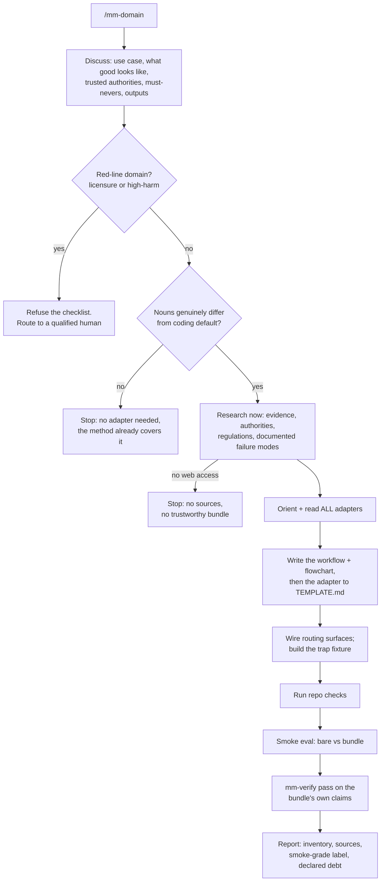

# mm-domain

The mm-method ships domain adapters that translate its loop into a sector's nouns. This skill makes a new one and hands the user a usable, step-by-step **workflow with a flowchart** for the domain, so a lesser model can approach that domain the way model-mesh would.

## What it produces (the bundle; all four, or not done)

1. **A domain workflow with a flowchart [v1.4].** The step-by-step approach for this domain, distilled from the discussion and research, plus a mermaid flowchart, the same shape as this method's own `references/flowcharts.md`. This is the user-facing "here are the steps, in order" artifact. It lives in the adapter's Workflow section (see `TEMPLATE.md`).
2. **The adapter**, conforming to `references/domains/TEMPLATE.md`, every named regulation/policy/figure carrying a fetched source in its Sources section.

## Stage 1: Discuss [v1.4]

**Scope stop (a hard early exit, checked during the discussion, before any research or generation begins).** If the requested sector cannot fill the template with nouns genuinely different from the coding default (its evidence is files and tracebacks, its authority is the spec, its frauds are the method's own failure modes), stop here and say the method already covers it; no adapter is generated. Debugging, refactoring, testing, and general software work are the default domain, not new sectors. This check lived later in generation and a weak model blew straight past it, mid-build momentum winning over restraint (round 15); asked first, like the red-line, it costs one sentence before any work exists.

## Stage 2: Research [covenant]

Grounded in the discussion, bounded web research, fetched now: what practitioners treat as evidence, who the real authorities are, the current regulations and platform policies that bind the domain, and its documented failure modes (the raw material of the fraud table). Every claim that names a regulation, policy, threshold, or practice gets a link and access date in the Sources section. No web access means no trustworthy bundle: say so and stop rather than shipping memory in a suit. (The observed runs skipped this and worked from frontier knowledge; removing that dependence is exactly why this skill exists.)

## Stage 3: Generate the bundle

1. **Orient and read ALL existing adapters, not a sample [observed].** Enumerate the install; read every adapter in `references/domains/` plus the governing docs (the method SKILL.md router, mm-verify, flowcharts, README, CHANGELOG, TEMPLATE.md). The schema is learned from the corpus and the template together.
2. **Scope the sector [observed].** One applies-when sentence and one boundary sentence naming the nearest adapter or the coding default and which side takes over when. (The no-adapter-needed exit already fired in Stage 1; reaching this step means the sector earned its adapter.)
3. **Write the workflow and its flowchart [v1.4].** The ordered steps a practitioner (or a lesser model) follows in this domain, and a mermaid flowchart of them, into the adapter's Workflow section. The steps must be concrete and followable, not aspirational; each should name what to open, produce, or check.
4. **Write the adapter to TEMPLATE.md [observed schema].** Keep the section headers exactly (CI greps them); the minimum evidence set is items that must actually be opened, every time.
5. **Wire every routing surface [observed].** The method SKILL.md adapter paragraph, the flowcharts router, the README adapter list and count, mm-verify's sector list if it enumerates sectors, and the CHANGELOG. Keep the README and flowchart router copies byte-identical.
6. **Build the trap fixture [covenant].** Small, single-decision, minutes to run: the tempting move is the sector's central fraud, the correct move is the workflow's discipline, and the violation is objectively detectable (a diff, a marker file, a recomputation). GROUND-TRUTH.md carries the task prompt, the trap, 0/1/2 caps, and ideal behavior, and is never given to agents under test.

## Stage 4: Verify, smoke-eval, report

1. **Verify mechanically [observed].** Run the repo's own check script; fix what fails.
2. **Smoke eval [covenant].** Run the fixture bare vs with the bundle (via mm-verify suite mode, or the headless harness for skill-discovery cases). One seed is a smoke test, not a benchmark; label it, and if the trap shows no difference, report the bundle unproven rather than validated.
4. **Report outcome-first.** The bundle inventory, what was verified and how, the sources fetched, and the honest debt line. Match the observed runs, which declared their eval debt unprompted.

## Bounds

- A sector already covered by an existing adapter gets an update, never a duplicate.
- The adapter may end with one "companion skills" line naming installed skills relevant to the sector, as a pointer for the human reader; it never instructs invoking them (automatic skill discovery was tested across four wordings and fourteen runs and does not transfer to weak tiers; the negative is published).
- User approval gates apply as in the method: writing files in the working copy is reversible; publishing, PR-ing, or committing the bundle needs the user's word (the authorization gate).
- This skill structures domain work; it does not confer domain authority. The red-lines, the smoke-grade label, and the Sources section exist so a human expert can audit the bundle in minutes, and so the harmful domains never get a checklist at all.
- **Small-model boundary, measured not guessed.** Generation quality tracks the model (a mid-tier model scores 9-10, a small-tier model ~6 on the round-12 bar; a small-tier model run also generated a redundant adapter for the coding default before the Stage 1 scope stop existed). Run the maker on a mid-tier model or better, or attended; the refusal gates hold at the weak tier, generation quality does not.
